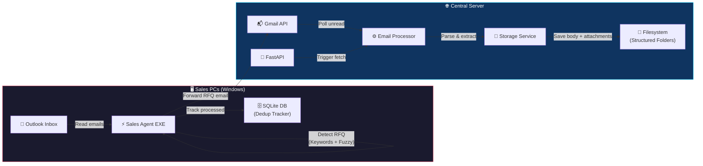
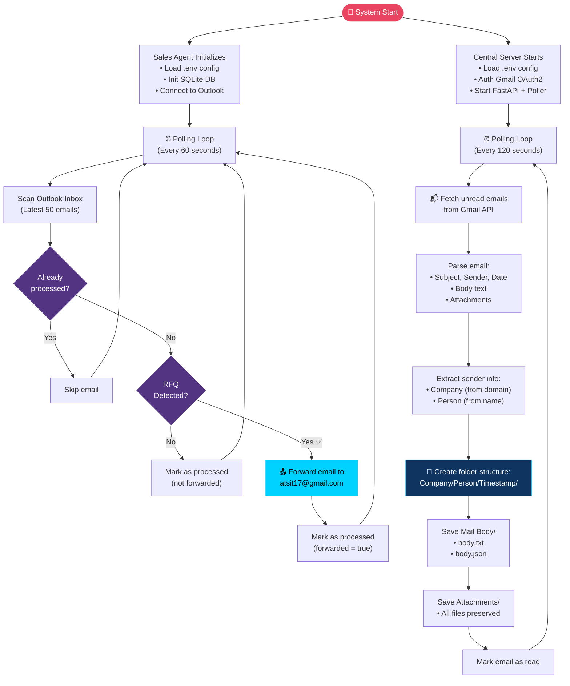
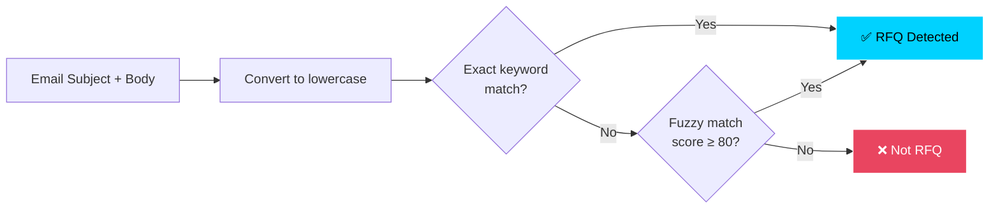

# ⚡ Ragnarok Email Service

> Production-ready **RFQ (Request for Quotation)** email processing system — automatically detects, forwards, and archives RFQ emails from sales teams into a structured repository.

---

## 📋 Table of Contents

- [Overview](#overview)
- [System Architecture](#system-architecture)
- [Project Flowchart](#project-flowchart)
- [Component Details](#component-details)
- [Folder Structure](#folder-structure)
- [How to Run](#how-to-run)
- [API Reference](#api-reference)
- [Configuration](#configuration)
- [Building the EXE](#building-the-exe)
- [Storage Format](#storage-format)
- [Future Roadmap](#future-roadmap)
- [Tech Stack](#tech-stack)

---

## Overview

Ragnarok Email Service consists of **two independent components** that work together:

| Component | Runs On | Purpose |
|-----------|---------|---------|
| **Sales Agent** | Windows PCs (Sales Team) | Monitors Outlook, detects RFQ emails, forwards them |
| **Central Server** | Cloud / Office Server | Receives forwarded emails, stores them in structured folders |

---

## System Architecture



---

## Project Flowchart

### End-to-End Data Flow



### RFQ Detection Logic



**Keywords scanned:** `rfq`, `request for quotation`, `request for quote`, `quotation request`, `price inquiry`, `price enquiry`, `quote request`, `bid request`, `tender`

---

## Component Details

### 1. Sales Agent

| Module | File | Responsibility |
|--------|------|----------------|
| **Entry Point** | `main.py` | Polling loop, orchestration, logging setup |
| **Outlook Client** | `services/outlook_client.py` | COM automation — read inbox, extract data, forward |
| **RFQ Detector** | `services/rfq_detector.py` | Keyword matching + RapidFuzz fuzzy matching |
| **Database** | `database/repository.py` | SQLite with WAL mode — dedup tracking |
| **Config** | `config/settings.py` | Loads `.env`, provides typed settings |

### 2. Central Server

| Module | File | Responsibility |
|--------|------|----------------|
| **Entry Point** | `main.py` | FastAPI app + async background email poller |
| **Gmail Client** | `services/gmail_client.py` | OAuth2 auth, fetch messages, download attachments |
| **Storage Service** | `services/storage_service.py` | Structured folder creation, file writing |
| **Email Processor** | `services/email_processor.py` | Orchestrates: Gmail → parse → store → mark read |
| **API Routes** | `app/routes.py` | REST endpoints for health check & manual triggers |
| **Config** | `app/config.py` | Loads `.env`, provides typed settings |

---

## Folder Structure

```
Ragnarok Email Service/
│
├── 📄 README.md
├── 📄 .gitignore
│
├── 📂 sales-agent/                    # Component 1: Windows EXE
│   ├── main.py                        # Entry point — polling loop
│   ├── requirements.txt               # Python dependencies
│   ├── .env.example                   # Config template
│   ├── 📂 config/
│   │   └── settings.py                # Environment config loader
│   ├── 📂 services/
│   │   ├── outlook_client.py          # Outlook COM automation
│   │   └── rfq_detector.py            # RFQ keyword + fuzzy detection
│   ├── 📂 database/
│   │   └── repository.py              # SQLite dedup repository
│   ├── 📂 build/
│   │   └── sales_agent.spec           # PyInstaller build spec
│   └── 📂 logs/                       # Runtime logs (auto-created)
│
├── 📂 central-server/                 # Component 2: FastAPI Server
│   ├── main.py                        # Entry point — FastAPI + poller
│   ├── requirements.txt               # Python dependencies
│   ├── .env.example                   # Config template
│   ├── 📂 app/
│   │   ├── config.py                  # Environment config loader
│   │   └── routes.py                  # FastAPI API endpoints
│   ├── 📂 services/
│   │   ├── gmail_client.py            # Gmail API OAuth2 client
│   │   ├── storage_service.py         # Structured folder storage
│   │   └── email_processor.py         # Fetch → parse → store orchestrator
│   ├── 📂 credentials/                # Google OAuth credentials (gitignored)
│   ├── 📂 storage/                    # Email archive (auto-created)
│   └── 📂 logs/                       # Runtime logs (auto-created)
│
└── 📄 prompt.txt                      # Original project specification
```

---

## How to Run

### Prerequisites

- **Python 3.10+** installed
- **Git** installed
- **pip** or **virtualenv** available

### Step 1: Clone the Repository

```bash
git clone https://github.com/dkoustubh/Ragnorok-Email-Service.git
cd Ragnorok-Email-Service
```

---

### Step 2: Setup Sales Agent (Windows Only)

> ⚠️ **The Sales Agent requires Windows** — it uses Outlook COM automation via `pywin32`.

#### 🚀 One-Click Launch (Recommended)
Simply double-click the **`run_agent.bat`** file inside the `sales-agent` folder. This script will:
1. Verify Python installation.
2. Create the `.env` configuration file from the template (if missing).
3. Set up the virtual environment (`venv`) and install all required libraries.
4. Auto-launch the agent daemon process directly!

#### Manual Setup
```bash
cd sales-agent

# Create virtual environment
python -m venv venv
venv\Scripts\activate        # Windows

# Install dependencies
pip install -r requirements.txt

# Create your .env from template
copy .env.example .env
# Edit .env with your settings
```

**Configure `.env`:**
```ini
FORWARD_TO=atsit17@gmail.com        # Central mailbox
CHECK_INTERVAL_SECONDS=60           # Scan frequency
OUTLOOK_FOLDER=Inbox                # Outlook folder to monitor
RFQ_KEYWORDS=rfq,request for quotation,quote request,tender
FUZZY_MATCH_THRESHOLD=80            # Fuzzy matching threshold
```

**Run:**
```bash
python main.py
```


The agent will:
1. Connect to Outlook on the local machine
2. Scan the Inbox every 60 seconds
3. Detect RFQ emails and forward them
4. Log all activity to `logs/`

---

### Step 3: Setup Central Server

#### 3a. Get Gmail API Credentials

1. Go to [Google Cloud Console](https://console.cloud.google.com/)
2. Create a new project (or select existing)
3. Enable the **Gmail API**
4. Go to **Credentials** → Create **OAuth 2.0 Client ID** (Desktop App)
5. Download the JSON file
6. Save it as `central-server/credentials/credentials.json`

#### 3b. Install & Run

```bash
cd central-server

# Create virtual environment
python -m venv venv
source venv/bin/activate     # macOS/Linux
# venv\Scripts\activate      # Windows

# Install dependencies
pip install -r requirements.txt

# Create your .env from template
cp .env.example .env
# Edit .env if needed
```

**Configure `.env`:**
```ini
GMAIL_ADDRESS=atsit17@gmail.com
GMAIL_CREDENTIALS_FILE=credentials/credentials.json
GMAIL_TOKEN_FILE=credentials/token.json
STORAGE_ROOT=storage/Downloads/Emails
CHECK_INTERVAL_SECONDS=120
HOST=0.0.0.0
PORT=8000
```

**Run:**
```bash
python main.py
```

On first run, a browser window will open for Gmail OAuth authorization. After that, the server will:
1. Start the FastAPI server on `http://localhost:8000`
2. Begin polling Gmail every 120 seconds
3. Store emails in structured folders under `storage/`

**Access the API docs:**
```
http://localhost:8000/docs
```

---

## API Reference

| Method | Endpoint | Description |
|--------|----------|-------------|
| `GET` | `/api/v1/health` | Health check — returns `{"status": "ok"}` |
| `POST` | `/api/v1/emails/fetch` | Trigger email fetch in background (async) |
| `GET` | `/api/v1/emails/fetch/sync` | Fetch emails synchronously, returns `{"processed": N}` |

### Example Usage

```bash
# Health check
curl http://localhost:8000/api/v1/health

# Trigger async fetch
curl -X POST http://localhost:8000/api/v1/emails/fetch

# Sync fetch with count
curl http://localhost:8000/api/v1/emails/fetch/sync
```

---

## Configuration

### Sales Agent `.env`

| Variable | Default | Description |
|----------|---------|-------------|
| `FORWARD_TO` | `atsit17@gmail.com` | Email to forward RFQs to |
| `CHECK_INTERVAL_SECONDS` | `60` | Seconds between inbox scans |
| `OUTLOOK_FOLDER` | `Inbox` | Outlook folder to monitor |
| `RFQ_KEYWORDS` | *(see .env.example)* | Comma-separated detection keywords |
| `FUZZY_MATCH_THRESHOLD` | `80` | RapidFuzz match threshold (0–100) |
| `LOG_LEVEL` | `INFO` | Logging level |

### Central Server `.env`

| Variable | Default | Description |
|----------|---------|-------------|
| `GMAIL_ADDRESS` | `atsit17@gmail.com` | Gmail account to read from |
| `GMAIL_CREDENTIALS_FILE` | `credentials/credentials.json` | OAuth2 credentials path |
| `GMAIL_TOKEN_FILE` | `credentials/token.json` | Cached auth token path |
| `STORAGE_ROOT` | `storage/Downloads/Emails` | Base path for email archive |
| `CHECK_INTERVAL_SECONDS` | `120` | Seconds between Gmail polls |
| `HOST` | `0.0.0.0` | Server bind address |
| `PORT` | `8000` | Server port |

---

## Building the EXE

To package the Sales Agent as a standalone Windows EXE:

```bash
cd sales-agent

# Using the included spec file
pyinstaller build/sales_agent.spec

# Or manually
pyinstaller --onefile --name RagnarokSalesAgent main.py
```

The EXE will be generated in `sales-agent/dist/RagnarokSalesAgent.exe`.

> **Note:** Bundle the `.env` file alongside the EXE when deploying to sales PCs.

---

## Storage Format

Emails are stored in the following hierarchy:

```
storage/Downloads/Emails/
└── 📂 Acme/                          # Company (from sender domain)
    └── 📂 John Doe/                  # Person (from sender name)
        └── 📂 20240115_143022/        # Timestamp of email
            ├── 📂 Mail Body/
            │   ├── body.txt           # Plain text body
            │   └── body.json          # Full metadata as JSON
            └── 📂 Attachments/
                ├── specifications.pdf
                └── drawing.dwg
```

**`body.json` format:**
```json
{
  "subject": "RFQ - Steel Components Q1 2024",
  "from": "John Doe <john@acme.com>",
  "date": "Wed, 15 Jan 2024 14:30:22 +0530",
  "body": "Dear Sir, Please find attached our RFQ...",
  "attachment_count": 2
}
```

---

## 🏗️ Production Server Architecture & Deploy (192.168.11.86)

To balance load and ensure message reliability when processing simultaneous bursts of RFQ requests, the Central Server uses an asynchronous queueing system.

```
                  ┌──────────────────────┐
                  │      Nginx Proxy     │ (Exposed Port 80)
                  │    (Load Balancer)   │
                  └──────────┬───────────┘
                             │ (Round-Robin)
             ┌───────────────┼───────────────┐
             ▼               ▼               ▼
      ┌────────────┐   ┌────────────┐   ┌────────────┐
      │ FastAPI #1 │   │ FastAPI #2 │   │ FastAPI #3 │ (Poller instances)
      └──────┬─────┘   └──────┬─────┘   └──────┬─────┘
             │                │                │ (Publish Task)
             ▼                ▼                ▼
     ┌───────────────────────────────────────────┐
     │           RabbitMQ Message Queue          │
     └─────────────────────┬─────────────────────┘
                           │ (Fair Dispatch Prefetch=1)
                           ▼
                  ┌─────────────────┐
                  │  Python Worker  │ (Async consumer)
                  └─┬─────────────┬─┘
                    │             │
     (Primary CRUD) │             │ (Secondary Backup)
                    ▼             ▼
             ┌────────────┐  ┌────────────┐
             │ PostgreSQL │  │ Remote NAS │ (192.168.11.153:3000)
             │  (BYTEA)   │  │  (WebDAV)  │
             └────────────┘  └────────────┘
```

### 🗄️ Primary CRUD Storage Schema (PostgreSQL)
The main database holds both metadata and binary attachment blocks (`BYTEA`) directly. No files are saved to the server local filesystem.
- `emails`: message ID, sender, subject, date, body text, and NAS path reference.
- `attachments`: name, size, and binary blob data (`BYTEA`).

### ⚙️ How to Deploy on `192.168.11.86`

1. **SSH into the Server**:
   ```bash
   ssh ats@192.168.11.86
   # Password: 1234
   ```
2. **Clone and Navigate to Server Folder**:
   ```bash
   git clone https://github.com/dkoustubh/Ragnorok-Email-Service.git
   cd Ragnorok-Email-Service/central-server
   ```
3. **Configure Environment Options**:
   Ensure `.env` matches your environment credentials:
   - PostgreSQL credentials (`admin` / `Ats@123*`).
   - NAS WebDAV credentials (`AI-GPU` / `Atsit123*`).
4. **Boot Up Stack**:
   ```bash
   docker-compose up --build -d
   ```
5. **Scale Out Web Instances** (Optional load balancing):
   ```bash
   docker-compose up --scale web=3 -d
   ```
This brings up RabbitMQ, a worker service, multiple scaled backend FastAPI nodes, and Nginx proxying traffic on Port 80.

---

## Tech Stack

| Layer | Sales Agent | Central Server |
|-------|-------------|----------------|
| **Language** | Python 3.10+ | Python 3.10+ |
| **Email** | pywin32 (Outlook COM) | Gmail API |
| **Message Queue** | — | RabbitMQ (pika) |
| **Database** | SQLite (WAL mode) | PostgreSQL (`psycopg2` BYTEA blob) |
| **Storage Backup** | — | NAS (WebDAV / HTTP Port 3000) |
| **Web Server** | — | FastAPI + Uvicorn |
| **Proxy / Balancer** | — | Nginx |
| **Packaging** | PyInstaller | Docker & Docker Compose |


---

## License

This project is proprietary. All rights reserved.

---

<p align="center">
  <b>Built with ⚡ by the Ragnarok Team</b>
</p>